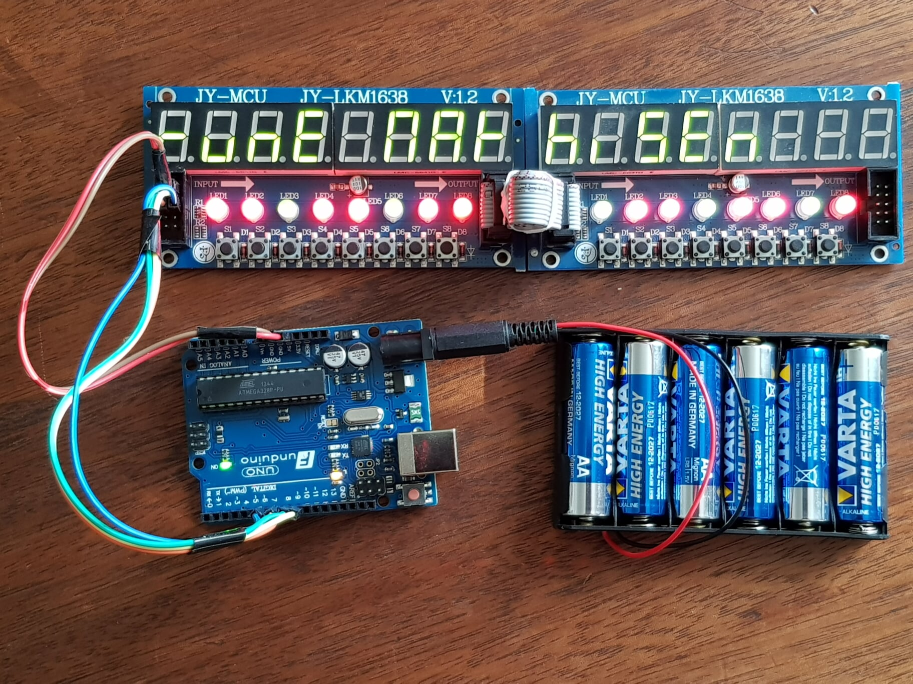

# 7-segment classroom display

In this project a 7-segment display is used for learning classmate names. 
See this [Assignment (norwegian only)](assignment_NB_no.pdf).

# Setup 

* 1 x Arduino Uno R3
* 2 x TM1638 LED module

